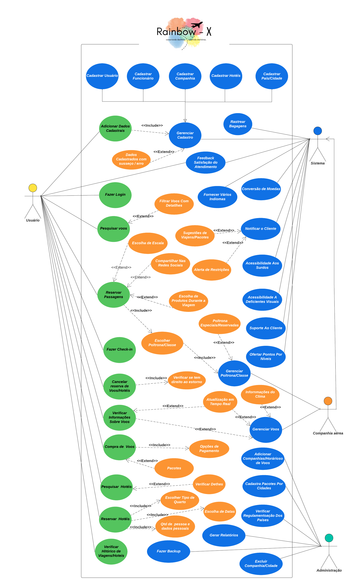

# Diagrama de Casos de Uso

- **Seleção de Casos de Uso:** Liste os Diagramas de Casos de Uso que são considerados arquiteturalmente significativos para o sistema.
- **1° - Gerenciar Cadastro;** 
- **2° - Fazer Login;** 
- **3° - Pesquisar Voos;** 
- **4° - Comprar Voos/Pacotes;** 
- **5° - Gerenciar Voos.**   

- **Critérios de Seleção:** Explique os critérios que levaram à seleção desses casos de uso. 
- **Impacto na Arquitetura:**  Os casos de usos listados acima, afetam a estrutura global do sistema e sua conformidade com a arquitetura definida. 
- **Complexidade e Interdependência:** Levando em conta a complexidade de cada caso de uso e suas interdependências com outros componentes do sistema. 
- **Alinhamento Com Objetivos de Negócios:** Podemos avaliar que os casos de uso contribuem diretamente para alcançar os objetivos estratéjicos e de negócios do projeto.  
- **Viabilidade Técnica:** Também foram analizadas as implementações de cada caso de uso, constatou-se que, todos são viáveis tecnicamente e podem ser realizados dentro do sistema.  
- **Prioridade do Cliente ou Usuário:** Podemos considerar a importancia percebida pelos clientes ou usuários em relação ao casos de uso. 
- **Risco Associado:** Também foram avaliados os riscos associados à implementação de cada caso de uso. 
- **Potencial para Reutilização:** Ao analizarmos o diagrama de casos de uso podemos ver que os casos de uso selecionados pode ser reutilizados em diferentes partes do sistema ou em projetos futuros.  

- **Descrição de Casos de Uso:** Forneça uma breve descrição de cada caso de uso, destacando sua importância arquitetural. 
- **Gerenciar Cadastro:** Este caso de uso faz toda a parte de gerenciamento de cadastro de usuários,funcionários, companhias,hotéis e Países/Cidades. Ele é represitado por uma classe abstrata ou uma interface na arquitetura do sistema delegando seus métodos as suas sub-classes concretas; 
- **Fazer Login:** Responsavel pelo gerenciamento/validação de usuário e senha dos clientes permitindo ou não acesso ao sistema, arquiteturalmente voltado a segurança do sistema permitindo acesso conialvel.  
- **Pesquisar Voos:** Permite aos clientes fazerem buscas por voos,hotéis,pacotes de viagens e etc.  
- **Comprar Voos/Pacotes:** Permite aos clientes comprarem voos,reserva de hotéis,pacotes de viagens. 
- **Gerenciar Voos:** Permite aos clientes/funcionários acompanharem em tempo real os dados de um voo específico,claro que o cliente só tem permissões para verificar os dados do seu voo.   

- **Pontos Complexos da Arquitetura:** Identifique quais pontos complexos e específicos da arquitetura são enfatizados ou ilustrados por cada caso de uso. 

# Cenários:
<!-- **Crie o Cenário:** Crie o cenário completo de ao menos 5 casos de uso.<br--> 

|Nome do Caso de Uso | Gerenciar Cadastro |
| -------------------| ------------------ |
|  Caso de Uso Geral |                    |
|  Ator Principal    |       Cliente / Funcionário     |
|  Ator Secundários  |       Sistema      |
|      Resumo        |   Esse caso de uso descreve as etapas percorridas  pelo sistema para realisar o cadastro de um cliete          |
|  Pér-Condições |     Os dados do cliente devem ser inseridos confome solicitado  |
|  Pós-Condições |                                                                 |
|            **Fluxo Principal**          |
| **Ações do Ator/Cliente**       | **Ações do Sistema**|
| 1. Seleciona a opção de cadastro |                    |
|                   | 2. Apresentar os campos para inserção dos dados       |
| 3. Iserir os dados solicitados   |                    |
|                   | 4. Confirmar conclusão do cadastro ou apresentar erro |
|  Restrições/Validações |                                                          |

|Nome do Caso de Uso |     Fazer Login    |
| -------------------| ------------------ |
|  Caso de Uso Geral |                    |
|  Ator Principal    |       Cliente      |
|  Ator Secundários  |       Sistema      |
|      Resumo        |   Esse caso de uso descreve as etapas percorridas  pelo cliente para realisar login no sistema          |
|  Pér-Condições |     Os dados do cliente devem ser inserido confome cadastrado  |
|  Pós-Condições |                                                                |
|            **Fluxo Principal**          |
| **Ações do Ator/Cliente**       | **Ações do Sistema**|
| 1. Seleciona a opção de login    |                    |
|                   | 2. Apresentar os campos para inserção dos dados          |
| 3. Iserir os dados solicitados   |                    |
|                   | 4. Acessa a pagina inicial do sistema ou apresentar erro |
|  Restrições/Validações |                                                        |

|Nome do Caso de Uso |    Pesquisar Voos  |
| -------------------| ------------------ |
|  Caso de Uso Geral |                    |
|  Ator Principal    |       Cliente / Funcionário     |
|  Ator Secundários  |       Sistema      |
|      Resumo        |   Esse caso de uso descreve as etapas percorridas  pelo cliente para pesquisar voos         |
|  Pér-Condições |                                                        |
|  Pós-Condições |                                                        |
|            **Fluxo Principal**          |
| **Ações do Ator/Cliente**  | **Ações do Sistema**|
| 1. Selecionar uma Companhia |                    |
|                   | 2.  Apresentar companhia selecionada com alguns anuncios de voos|
| 3. Informa origem e destino                      |                      |
|                   | 4. Apresentar opções de voos conforme a origem e o destino      |
|  Restrições/Validações |                                                        |

|Nome do Caso de Uso |    Comprar Voos/Pacotes  |
| -------------------| ------------------ |
|  Caso de Uso Geral |                    |
|  Ator Principal    |       Cliente / Funcionário     |
|  Ator Secundários  |       Sistema      |
|      Resumo        |   Esse caso de uso descreve as etapas percorridas  pelo cliente para realisar compra de voos/pacotes         |
|  Pér-Condições |                                                        |
|  Pós-Condições |                                                        |
|            **Fluxo Principal**          |
| **Ações do Ator/Cliente** |   **Ações do Sistema**    |
| 1. Selecionar o opção comprar |                       |
|                   | 2. Apresentar os dados da viagem/pacote      |
| 3. Finalizar a compra     |                           |
|                   | 4. Confirmar conclusão da compra e gerar nota fiscal      |
|  Restrições/Validaçõe|                                                        |

|Nome do Caso de Uso |    Gerenciar Voos  |
| -------------------| ------------------ |
|  Caso de Uso Geral |                    |
|  Ator Principal    |       Funcionário     |
|  Ator Secundários  |       Sistema      |
|      Resumo        |   Esse caso de uso descreve as etapas percorridas  pelo funcionário para verificar o gerenciamento de voos |
|  Pér-Condições |                                                        |
|  Pós-Condições |                                                        |
|            **Fluxo Principal**          |
| **Ações do Ator** | **Ações do Sistema**|
| 1. Fazer Login |                    |
|                   | 2. Apresentar a página inicial do sistema      |
| 3. Selecionar Companhia             |                              |
|                   | 4. Apresentar página da companhia selecionada  |
| 5. Filtrar voo    |                                                |
|                   | 4. Apresentar dados em tempo real de um voo específico  |
|  Restrições/Validações |                                                    |