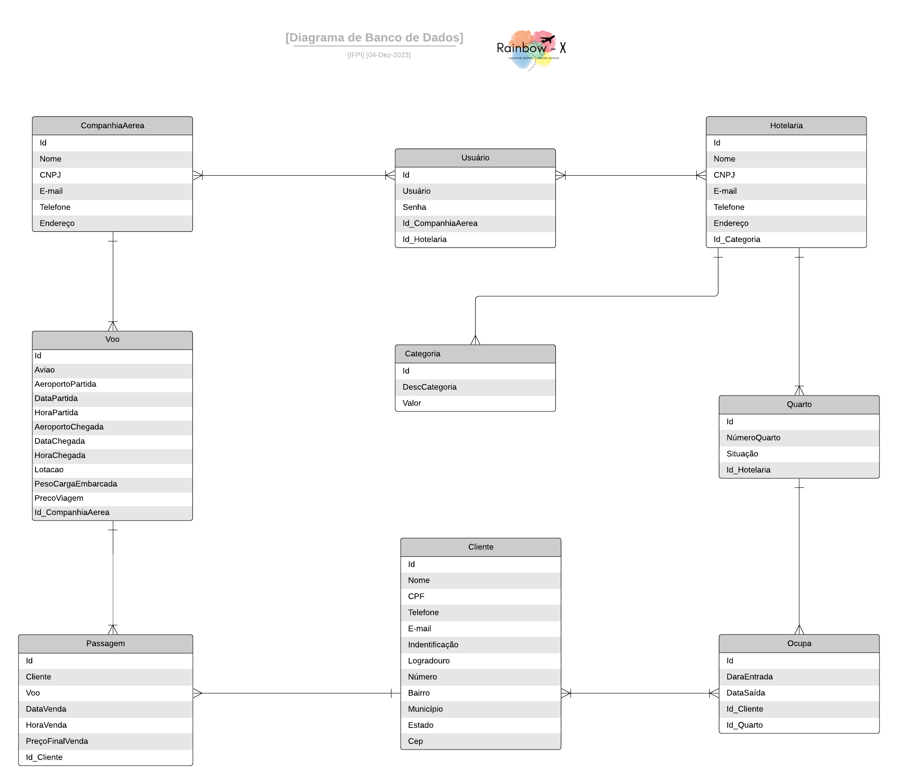

# Gerenciamento de Dados

# Estratégia de armazenamento de dados

Utilizamos o modelo **MER (Modelo Entidade Relacionamento)** pois ele é utilizado para descrever os objetos do mundo real atravez de entidades, com suas propriedades que são os atributos e os seus relacionamentos. Onde as entidades representam um objeto do mundo real e que possuem uma existencia independente, como: pessoa. empresa, carro entre outras coisas que podem ser representadas por uma entidade. Já os atributos descrevem as propriedades das entidades. A entidade **pessoa** pode ter como atributo o nome, cpf, idade. Os relacionamentos ocorrem entre as entidades havendo uma associação entre elas, que normalmente são representados por verbos. como, por exemplo, "uma pessoa trabalha para uma empresa".  

# Gerenciamento de bancos de dados
- Incluir também imagens e  o modelo do Diagrama de Dados. 

