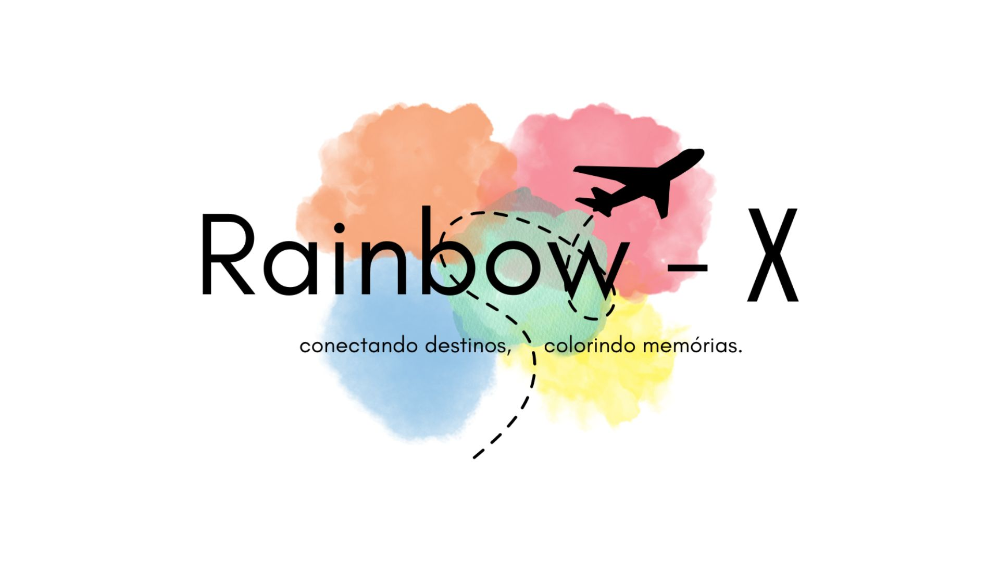

# Guia de Estilo

Este guia de estilo tem como função registrar as decisões de design relacionadas à implementação do projeto ----------. Serve como uma ferramenta de comunicação entre a equipe de design e a equipe de desenvolvimento.

## Logo

Autores:  

## Paleta de Cores

A paleta de cores é composta pelas sete cores do arco íris, 

## Tipografia

As fontes utilizadas na aplicação serão:

- Clarendon LT (Linotype) para títulos.
- Sacramento (Open Font License) para títulos.
- Enriqueta (Open Font License) para textos.

## Botões

Os botões utilizados no menu de navegação têm fundos transparentes e usam a cor marrom da paleta de cores em sua fonte, tornando-se mais claros quando o mouse é passado por cima.

Os demais botões utilizados possuem fundo marrom e a fonte branca.

