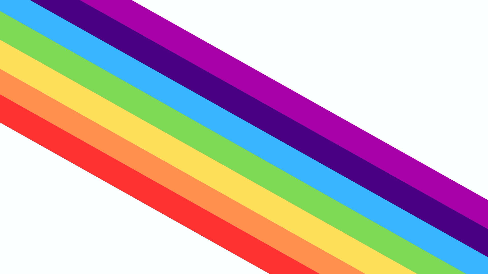

# Guia de Estilo

Este guia de estilo tem como função registrar as decisões de design relacionadas à implementação do projeto Rainbow Explore. Serve como uma ferramenta de comunicação entre a equipe de design e a equipe de desenvolvimento.

## Logo

Autores:Beatriz, Yanne, Assunção, Denes, Ana Vitoria. 

## Paleta de Cores

A paleta de cores é composta pelas sete cores do arco íris o vermelho, laranja, amarelo, verde, azul, anil e violeta. Na logo foram usadas as cinco primeiras cores em sua tonalidade mais neutra. Logo abaixo é exibido os tons da paleta. 
 

## Tipografia

As fontes utilizadas na aplicação serão:

- Lora para barra de navegação.
- Hermeneus One para nome de estados.
- Cantarell para textos e botões.
- Cinzel para títulos.

