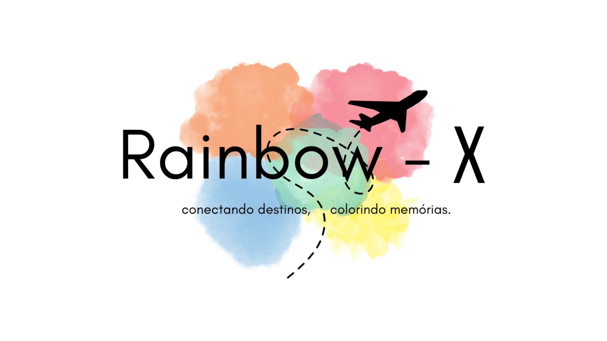

# Identificação do Projeto

|Projeto | Requisitante | Gerente de Projetos|
| -------| ------------ | -------------------|
|  Rainbow-Explore  | Prof: Cleber da S. Araujo |     Yanne Karoline       |

# Brainstorming 
- Explique e coloque imagens de todas as reuniões do grupo, incluindo explicação de como ocorreu, datas, colaboraçoes, o que foi excluido e acatado na reuinão.  Esta apresentação deve incluir todos os esboços iniciais, ideias e as contribuições de cada membro do grupo, além da lista de frequência e votação.  

| Debate em Grupo | Data | Imagens | Feedback |
| ----------| -----| --------|-----------|
|  - Nome da Equipe  | 17 a 21/08/2023   |               |**Como surgiu o nome “Agile minds”?**    Foi sugerido para os membros colocarem  sugestões no grupo do Whatsapp.  Após os integrantes Denes e Ana Vitória  sugerirem alguns nomes conforme imagens ao  lado a Beatriz optou por 'Agile minds' e os  demais acompanharam. | 

| 1° - Reunião  Definições|Integrantes| Frequência | Data | Imagens | Feedback |
| ----------| ------  | -----------|-----------|-----------|-----------|
|  - Logo/Nome do Sistema - Carogos   - Ordem da 1°  Apresentação    |   Ana Vitória Assunção Beatriz Denes Karol |  Ausente Presente Presente Presente Presente   |   26/08/2023    |       |   => Cada integrante decide um nome para o sistema;  => Decidir uma paleta de cores; => Combinado uma nova reunião para construção da logo;  =>  **Funções de cada integrante no 1° momento:**  --> Arquiteto de Software: (Yanne Karoline);  -->Desenvolvedor Sênio: (Beatriz e Denes);  --> Analista de Requisitos: (Ana Vitória);  --> Gerente de Qualidade: (Assunção). | 

| 2° - Reunião  Definições|Integrantes| Frequência | Data | Imagens | Feedback |
| ----------| ------  | -----------|-----------|-----------|-----------|
| -Definiçao da   Paleta de Cores  -Definiçaõ da  Logo/Nome  -Criação da Logo    |   Ana Vitória Assunção Beatriz Denes Karol |  Ausente Presente Presente Presente Presente   |   30/08/2023    |                       | Para definição da paleta de cores pensamos na pedra preciosa opala e  automaticamente no arco iris que tem suas cores representada na jóia.    Quanto a criação e definição do nome da logo seguimos a mesmo ideia, a Beatriz surgeriu a  "Opala" como referência no nome da empresa e em conversa com a Ana Vitória  chegaram ao arco iris novamente, daí colocaram em inglês e achamos que ficou  legal, o "Rainbow" em votação ficou confome resultado na imagem ao lado,   e adicionamos o "Explore" na forma abreviada "X" que está relacionado a   "exploração de novos conhecimentos viajando mundo a fora.  |  

| 3° - Reunião  Definições|Integrantes| Frequência | Data | Imagens | Feedback |
| ----------| ------  | -----------|-----------|-----------|-----------|
| - Levantamento  de Requisitos  |   Ana Vitória Assunção Beatriz Denes Karol |  Presente Ausente Presente Presente Presente   |   11/09/2023    |        | Nessa reunião como o nosso cliente, por meio de várias pergunta foi onde ficou explícito que ele  precisava de um sistema de voos e hotéis baseado na CVC, mas com maiores seduções  para atrir clientes. Além disso com o desenrolar da conversa conseguimos abstrair os principais  requisitos funcionais e não funcionais para o desenvolvimento do sistema de nosso cliente.     |  

# Técnicas de Elicatação de Requisitos
- Para levantarmos os requisitos do sistema **Rainbow - X** utilizamos a técnica de entrevista semiestruturada com nosso cliente, dessa forma conseguimos extrair o maximo do que o sistema do nosso cliente realmente precia na implementação.
# Requisitos Funcionais
 

|Código |Identificação |Classificação |Ator |Objetivo|
|------ |--------------|--------------|-----|--------|
|[RF01] | Fazer Cadastro/Atualização | Importante |Usuário| Este caso de uso serve para o usuário fazer login;|
|[RF02] | Efetuar Login | Importante |Usuário| Este caso de uso serve para o usuário entrar no sistema;|
|[RF03] | Pesquisar Voos | Importante |Usuário| Este caso de uso serve para o usuário fazer busca por voos com detalhes específicos;|
|[RF04] | Pesquisar Hotéis | Importante |Usuário| Este caso de uso serve para o usuário fazer busca por hotéis;|
|[RF05] | Escolher Escalas | Importante |Usuário| Este caso de uso serve para o usuário fazer escolha das escalas na viagem;|
|[RF06] | Escolher Produtos | Importante |Usuário| Este caso de uso serve para o usuário fazer escolha dos produtos para consumir na viagem;|
|[RF07] | Reservar Voos | Importante |Usuário| Este caso de uso serve para o usuário fazer reserva de voos;|
|[RF08] | Fazer Check-in | Importante |Usuário| Este caso de uso serve para o usuário fazer check-in do voo;|
|[RF09] | Atualização | Desejável |Sistema| Este caso de uso serve para o sistema fazer atualização em tempo real sobre o voo;|
|[RF10] | Reservar Hotéis | Importante |Usuário| Este caso de uso serve para o usuário fazer reserva hotél/tipo de quarto (luxo,super luxo);|
|[RF11] | Busca Detalhada Por Hotéis | Importante |Usuário| Este caso de uso serve para o usuário fazer busca por hotíes/quartos pelas catategorias;|
|[RF12] | Verificar Hóspedes | Importante |Sistema| Este caso de uso serve para o sistema solicitar dados pessoais e quantidade de hóspedes no ato da reserva;|
|[RF13] | Cancelar Reserva | Importante |Usuário| Este caso de uso serve para o usuário solicitar cancelamento de reservas voos/hotéis;|
|[RF14] | Comprar Pacotes | Importante |Usuário| Este caso de uso serve para permitir que o usuário compre pacotes de voos/hotéis;|
|[RF15] | Notificar Cliente | Importante |Sistema| Este caso de uso serve para o sistema fazer notificações para o cliente relacionadas a reserva;|
|[RF16] | Compartilhar Nas Redes Sociais | Importante |Usuário| Este caso de uso serve para o usuário fazer compartilhamento de suas reservas nas redes sociais;|
|[RF17] | Sugerir Viagens | Importante |Sistema| Este caso de uso serve para o sistema fazer notificações para o cliente com sugestões de viagens/pacotes;|
|[RF18] | Recuperar Senha | Importante |Usuário| Este caso de uso serve para o usuário solicitar nova senha;|
|[RF19] | Alertar Cliente | Importante |Sistema| Este caso de uso serve para o sistema fazer alerta ao cliente quanto as restrições do país o qual ele deseja viajar;|
|[RF20] | Adicionar Companhia | Importante |Administração| Este caso de uso serve para a administração adicionar novas companhias aereas/horários de voos;|
|[RF21] | Cadastrar Pacote | Importante |Administração| Este caso de uso serve para a administração adicionar pacotes por Cidade/País;|
|[RF22] | Excluir Companhia/Cidade | Importante |Administração| Este caso de uso serve para a administração excluir Companhias/Cidades;|
|[RF23] | Gerar Relatório | Importante |Administração| Este caso de uso serve para a administração gerar relatórios;|
|[RF24] | Fazer Backup | Importante |Administração| Este caso de uso serve para a administração fazer backup;|
|[RF25] | Verificar Regulamentação | Importante |Administração| Este caso de uso serve para a administração fazer verificações de regulamentações dos países;|
|[RF26] | Espaço para feedback | Desejável |Usuário| Este caso de uso serve para a usuário dá um feedback quanto a satisfação do atendimento;|
|[RF27] | Verificar Histórico | Importante |Usuário| Este caso de uso serve para a usuário ver seus históricos de viagens/hotéis reservados;|
|[RF28] | Escolher Data | Importante |Usuário| Este caso de uso serve para a usuário fazer escolha de datas no ato da reservas;|
|[RF29] | Fazer Pagamento | Importante |Usuário| Este caso de uso serve para o usuário fazer pagamento com multiplas opções;|
|[RF30] | Fazer Comunicação | Desejável |Sistema| Este caso de uso serve para o sistema oferecer comunicação em vários idiomas;|
|[RF31] | Conversão de Moedas | Desejável |Sistema| Este caso de uso serve para o sistema ter a conversão de moedas; |
|[RF32] | Rastrear Bagagem | Importante |Sistema| Este caso de uso serve para a sistema fazer rastreamento das bagagens;|
|[RF33] | Acento Reservado | Importante |Usuário| Este caso de uso serve para o usuário ver as opções para passageiros especiais;|
|[RF34] | Sobre Clima | Importante |Usuário| Este caso de uso serve para o usuário ver como estão as condições climáticas;|
|[RF35] | Acessibilidade a Surdos | Desejável |Sistema| Este caso de uso serve para o sistema oferecer acessibilidade para surdos;|
|[RF36] | Acessibilidade a Deficiente visula | Desejável |Sistema| Este caso de uso serve para o sistema oferecer acessibilidade para deficientes visualais;|
|[RF37] | Suporte ao Cliente | Desejável |Sistema| Este caso de uso serve para o sistema fornecer suprorte ao cliente por assistente virtual;|
|[RF38] | Pontos Por Níveis | Desejável |Sistema| Este caso de uso serve para o sistema ofertar pontuação por nível de cliente.|

# Requisitos Não Funcionais 

|Código |Identificação |Classificação |Ator |Objetivo|
|------ |--------------|--------------|-----|--------|
|[RNF01] | Usabilidade |Importante |Sistema| Este caso de uso serve para o sistema oferta ao usuário fácio acesso ao mesmo;|
|[RNF02] | Responsividade |Importante |Sistema| Este caso de uso serve para o sistema se adptar a diversas plataformas;|
|[RNF03] | Rapidez |Importante |Sistema| Este caso de uso serve para o sistema ter agilidade na execução;|
|[RNF04] | Disponibilidade |Importante |Sistema| Este caso de uso serve para que o sistema esteja disponível na escala de 24x7;|
|[RNF05] | Sistema Operacional |Importante |Sistema| Este caso de uso serve para que o sistema seja acessado por todos os sistemas operacionais;|
|[RNF06] | Hardware a Ser Utiliadzo |Importante |Sistema| Este caso de uso serve para que o sistema seja acessado por todos os aparelhos eletrônicos;|
|[RNF07] | Capacidade de Acesso |Importante |Sistema| Este caso de uso serve para que o sistema tenha alta capacidade de acessos simultâneos;|
|[RNF08] | Time para Concluir Reserva |Importante |Sistema| Este caso de uso serve para que o sistema abortar reservas não concluídas em 15 min;|
|[RNF09] | Teste de Qualidade |Importante |Sistema| Este caso de uso serve para que o sistema seja aprovado nos testes de qualidade;|
|[RNF10] | Segurança da Senha |Importante |Sistema| Este caso de uso serve para o sistema Fazer verificação em duas etapas;|
|[RNF11] | Verificação de email |Importante |Sistema| Este caso de uso serve para o sistema Fazer verificação que existe um único email por usuário.|
