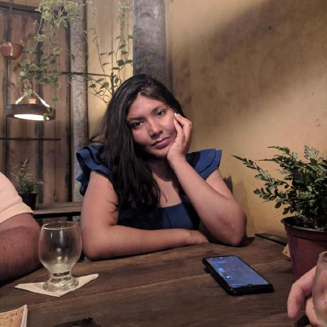

# Sobre

Este repositório é destinado ao grupo - [** Agile Minds**](https://github.com/karolKaroli/Rainbow-Explore.git), contém toda a documentação do   projeto da disciplina **Engenharia de Software III - Arquitetura e Design de Software**, ministrada pela Professor **Cleber Araujo**, no **Instituto Federal do Piaui Campus Pedro II, durante o período de 2023/2**.

<br />

# Rainbow Explore!!!
- Conectando destinos, colorindo memórias.
- Aqui você encontra os melhores pacotes de viagem como o melhór conforte e preços imperdiveis.


# Contribuidores

|Foto | Matrícula | Nome | GitHub | E-mail|
|:--:|:--:|:--:|:--:|:--:|
|| 20211p2ads0231 | Assunção Cardoso | [assuncaocardoso ](https://github.com/assuncaocardoso) |caped.20211p2ads0231@aluno.ifpi.edu.br|
|| 2022123tads0080 | Beatriz Bezerra | [BeatrizBezerraNasc ](https://github.com/BeatrizBezerraNasc) |caped.2022123tads0080@aluno.ifpi.edu.br|
|| 2022123tads0209 | Denes Duarte | [DenesDuarte ](https://github.com/DenesDuarte)|denesduarte.2016@gmail.com|
|| 2022123tads0110 | Yanne Karoline | [karolKaroli ](https://github.com/karolKaroli)|caped.2022123tads0110@aluno.ifpi.edu.br|

# Histórico de Revisões
|Versão | Data | Descrição | Autor | 
|-----|-----------|------|--------|
| 1.0  | 01/10/2023 | Adicionado Tela de Login| Cleber Araujo |

# Como usar algumas funções: 

# Documentação de Software

**Negrito**  
*Italico* 

1. Primeiro
2. Segundo
3. Terceiro  

-[x]Tomar Banho  
-[ ]Comer Cuscuz  
-[ ]Limpar casa 

|Nome |Idade|
|-----|-----|
|Eduardo|28| 
|Odineia|26|
|Abdenaide|22|

~~Tachado~~

```
    # coding: utf-8

    def soma(a, b):
        if isinstance(a, basestring) or isinstance(b, basestring):
            raise ValueError(u'Somente números são permitidos')
        return a + b
```

Emoji - :snake: :heart::rocket:

> "Essa é uma citação"

* Item 1
* Item 2

`def soma(a, b):
    if isinstance(a, basestring) or isinstance(b, basestring):
        raise ValueError(u'Somente números são permitidos')
    return a + b`

[Portal P2](https://www.portalp2.com)

For full documentation visit [mkdocs.org](https://www.mkdocs.org).


* `mkdocs new [dir-name]` - Create a new project.
* `mkdocs serve` - Start the live-reloading docs server.
* `mkdocs build` - Build the documentation site.
* `mkdocs -h` - Print help message and exit.

    mkdocs.yml    # The configuration file.
    docs/
        index.md  # The documentation homepage.
        ...       # Other markdown pages, images and other files.
