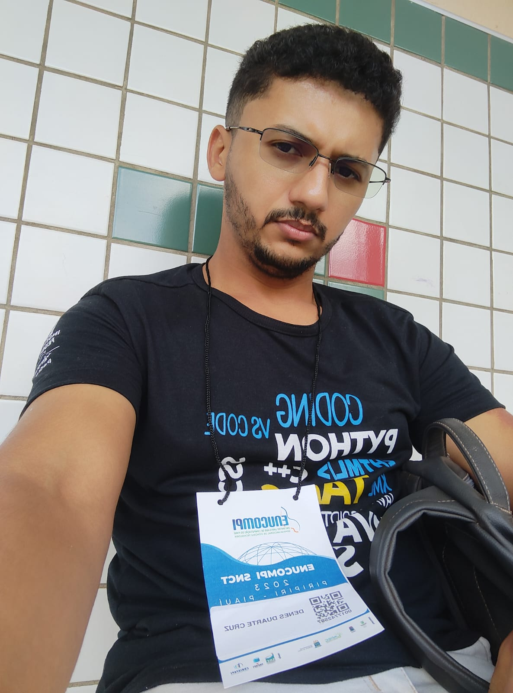

# Sobre

Este repositório é destinado ao grupo - [** Agile Minds **](https://github.com/karolKaroli/Rainbow-Explore.git), contém toda a documentação do   projeto da disciplina **Engenharia de Software III - Arquitetura e Design de Software**, ministrada pela Professor **Cleber Araujo**, no **Instituto Federal do Piaui Campus Pedro II, durante o período de 2023/2**.

 

# Rainbow Explore!!!
- Conectando destinos, colorindo memórias.
- Aqui você encontra os melhores pacotes de viagem como o melhor conforto e preços imperdiveis.

# Contribuidores

|Foto |Cargo| Matrícula | Nome | GitHub | E-mail|
|:--:|:--:|:--:|:--:|:--:|:--:|
|| Gerente de Qualidade | 20211p2ads0231 | Assunção Cardoso | [assuncaocardoso ](https://github.com/assuncaocardoso) |caped.20211p2ads0231@aluno.ifpi.edu.br|
|| Desenvolvedora Sênio |2022123tads0080 | Beatriz Bezerra | [BeatrizBezerraNasc ](https://github.com/BeatrizBezerraNasc) |caped.2022123tads0080@aluno.ifpi.edu.br|
|| Analista de Requisitos |2022123tads0209 | Denes Duarte | [DenesDuarte ](https://github.com/DenesDuarte)|denesduarte.2016@gmail.com|
|| Arquiteta de Software |2022123tads0110 | Yanne Karoline | [karolKaroli ](https://github.com/karolKaroli)|caped.2022123tads0110@aluno.ifpi.edu.br|

# Histórico de Revisões
|Versão | Data | Descrição | Autor | 
|-----|-----------|------|--------|
| 1.0  | 09/10/2023 | Requisitos | Denes Duarte |
| 2.0  | 30/10/2023 | protótipo | Beatriz Bezerra |
| 3.0  | 30/10/2023 | Escolha de ferramentas | Yanne Karoline |

