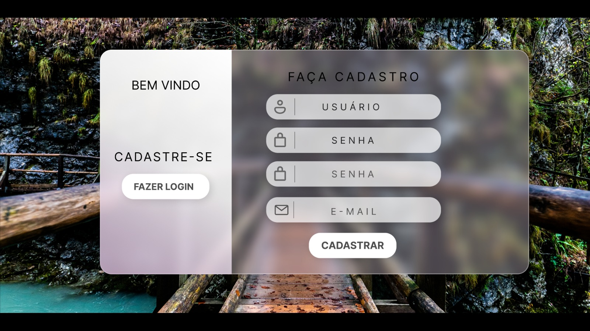
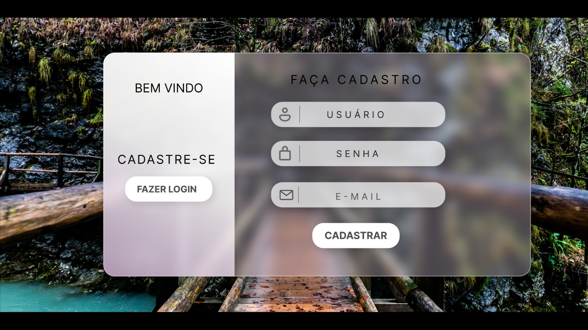
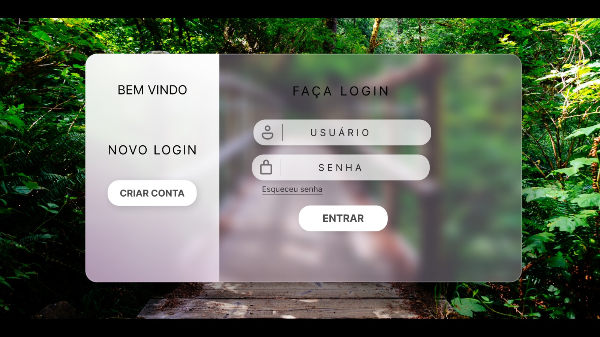
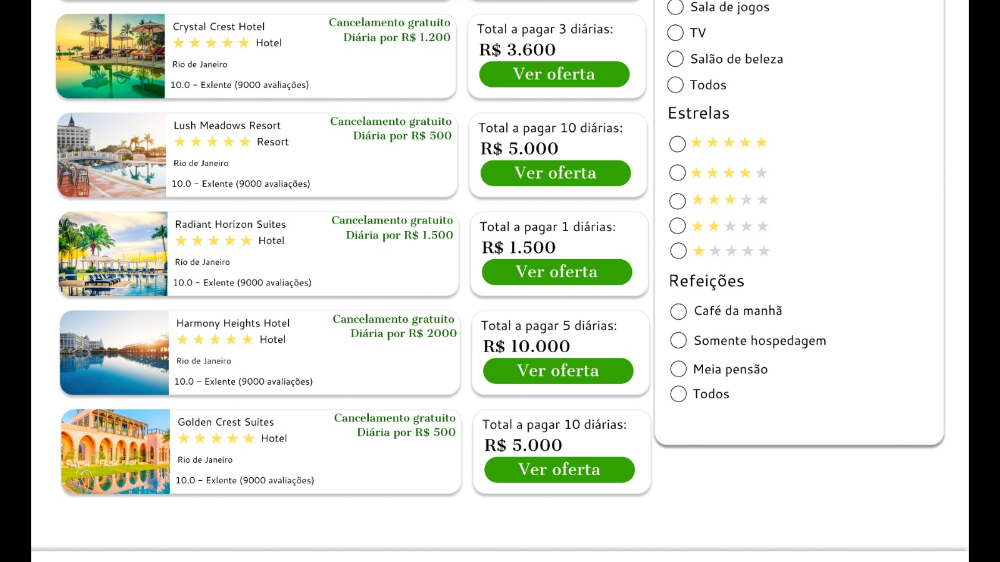

# Prototipação de Baixa Fidelidade
- [Inclua uma breve descrição dos primeiros esboços do projeto, (Opcional).]

# Vídeo do Protótipo
- **[Link do protótipo](https://www.figma.com/file/HEBI5Fmg2CCeRhvGBQREwm/Untitled?type=design&node-id=41-155&mode=design&t=p4Twe4OYQg9XG5mu-0)**

# Prototipação de Alta Fidelidade
- 
- 
- 
- 
- 
- 
- 
- 
- 
- 
