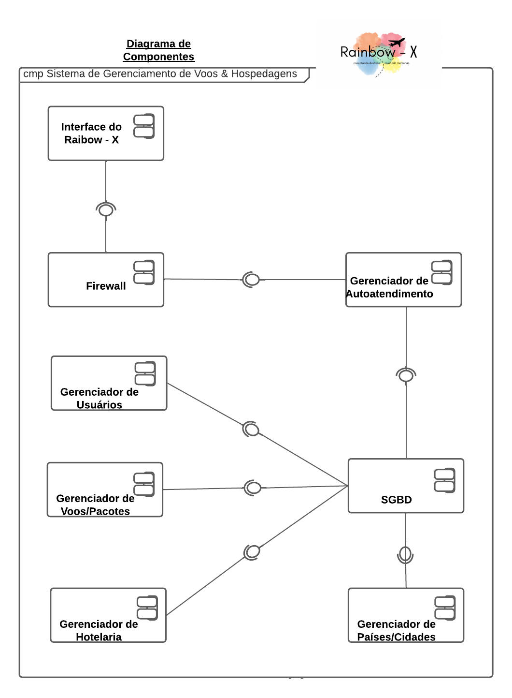
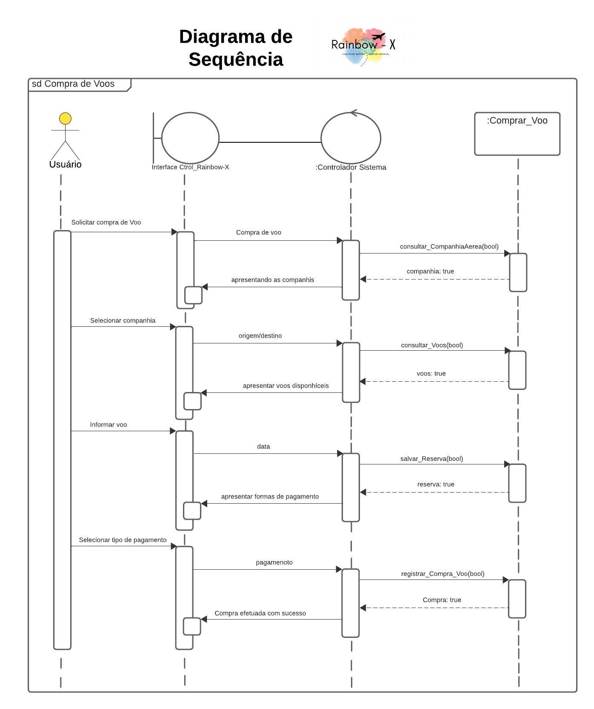
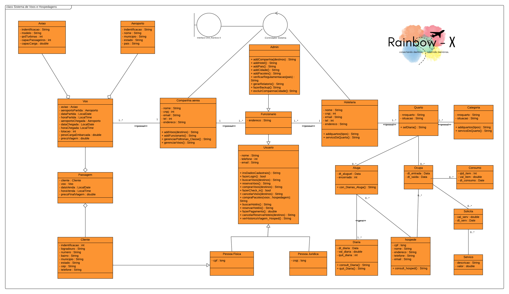

### Visão Geral

Nesta subseção, nomearemos e definiremos as diversas camadas e seu conteúdo, as regras que determinam a inclusão em uma camada específica e as fronteiras entre as camadas. Incluiremos um diagrama de componentes que mostra os relacionamentos entre as camadas.

#### Camadas da Arquitetura

**Camada de Apresentação:** é responsável pela interação direta com os usuários finais e pela exibição de informações de forma compreensível. Seu principal objetivo é apresentar a interface do sistema de maneira amigável e facilitar a comunicação entre os usuários e o sistema.

**Principais Componentes:**

- **Interface do Sistema:** Responsável pela apresentação visual e interativa do sistema aos usuários. Inclui elementos como menus, botões, formulários e painéis.

**Regras que determinam o que pertence a esta camada:** 

- Todos os elementos visuais e interativos que os usuários finais veem e manipulam estão na camada de apresentação. 
- A interface do sistema é o principal componente nessa camada, cuidando da exibição e interação. 
- Funcionalidades de autoatendimento destinadas aos usuários finais pertencem a esta camada.
- Essa camada garante uma experiência de usuário eficiente e intuitiva, separando a apresentação da lógica de negócios e do armazenamento de dados. A comunicação com outras camadas ocorre por meio de interfaces específicas para garantir a modularidade do sistema.

**Camada de Lógica de Negócios:** é responsável por processar as regras e operações específicas do domínio do sistema. Ela gerencia as funcionalidades centrais, a lógica de processamento e as operações que sustentam as operações essenciais do sistema.

**Principais Componentes:**

- **Gerenciador de Autoatendimento:**  Contém a lógica para processar transações e interações relacionadas ao autoatendimento, como reservas automáticas, check-ins online, etc;
- **Gerenciador de Usuários:** Responsável pela autenticação, autorização e gestão de perfis de usuários no sistema;
- **Gerenciador de Voos/Pacotes:** Lida com a lógica associada à programação, disponibilidade e reservas de voos e pacotes;
- **Gerenciador de Hotelaria:** Contém a lógica relacionada à gestão de quartos, reservas e serviços de hospedagem;
- **Gerenciador de Países/Cidades:** Responsável pela lógica relacionada a informações geográficas, como disponibilidade de voos em determinadas regiões.

**Regras que determinam o que pertence a esta camada:** 

- Todos os processos e operações essenciais ao negócio do sistema residem nesta camada. 
- A lógica de processamento específica do domínio, como cálculos de tarifas, disponibilidade de voos e gestão de reservas, pertence a esta camada. 
- Essa camada assegura que a aplicação opere de acordo com as regras e processos específicos do setor de viagens e hospedagem, proporcionando uma base sólida para as interações na interface do sistema.

**Camada de Dados:** é responsável pelo armazenamento, recuperação e gerenciamento de informações persistentes. Ela mantém os dados necessários para o funcionamento do sistema, garantindo consistência e integridade.

**Principais Componentes:**

- **SGBD (Sistema de Gerenciamento de Banco de Dados):** O componente central que gerencia e organiza os dados do sistema, permitindo a recuperação eficiente e segura da informação;
- **Gerenciador de Usuários:** Armazena dados de perfis de usuários, credenciais e permissões associadas;
- **Gerenciador de Voos/Pacotes:** Contém informações sobre itinerários, disponibilidade de voos, preços e reservas;
- **Gerenciador de Hotelaria:** Armazena dados relacionados a quartos, disponibilidade, reservas e serviços de hospedagem;
- **Gerenciador de Países/Cidades:** Mantém informações geográficas, como destinos, aeroportos e características específicas de cada local.

**Regras que determinam o que pertence a esta camada:**

- Toda informação persistente e necessária para a operação do sistema é armazenada nesta camada.
- O SGBD é o componente central que interage com todos os outros gerenciadores, garantindo consistência nos dados.
- As interfaces de comunicação com outros componentes são padronizadas para garantir a integridade dos dados.

#### Diagrama de Componentes da Arquitetura

A figura a seguir ilustra a estrutura de camadas da arquitetura e seus relacionamentos:

### Diagrama de Sequência

Nesta seção, apresentaremos diagramas de sequência que ilustram as interações entre os componentes do sistema em cenários-chave. Esses diagramas destacarão o fluxo de controle e as trocas de mensagens entre os componentes.

### Diagrama de Classes

Aqui, forneceremos um diagrama de classes que descreve a estrutura de classes do sistema, incluindo atributos e métodos. Esse diagrama ajudará a entender a estrutura dos componentes em cada camada e as relações entre eles.

